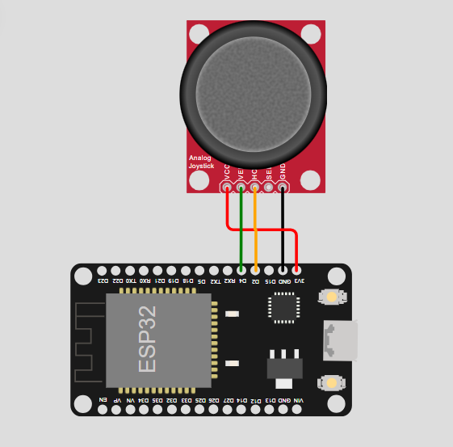
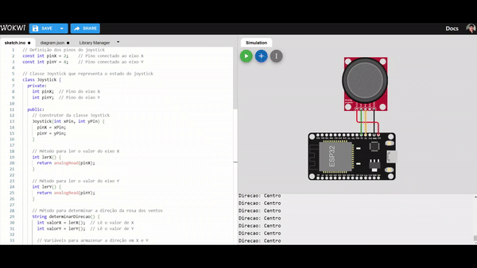

# Projeto Rosa dos Ventos com ESP32 e Joystick

Este projeto utiliza um **ESP32** para ler os valores de um **joystick** e determinar a direção na **rosa dos ventos** (Norte, Sul, Leste, Oeste e as direções diagonais). O joystick fornece valores analógicos para os eixos X e Y, que são usados para calcular a direção. A saída é exibida no **Monitor Serial**, mostrando a direção atual em que o joystick está apontando.

## Circuito
<div align="center">
    
</div>

### Componentes do Circuito

- **Joystick Analógico**: Fornece valores analógicos para os eixos X e Y, usados para determinar a direção do movimento.
- **ESP32**: Microcontrolador que processa os valores do joystick e imprime a direção correspondente no monitor serial.

### Explicação do Circuito

O joystick é conectado aos pinos analógicos do **ESP32**:
- O eixo **X** está conectado ao pino **D2** (pinX).
- O eixo **Y** está conectado ao pino **D4** (pinY).

A leitura dos valores do joystick permite calcular a direção na rosa dos ventos:
- O eixo **X** varia de 0 a 4095, onde 0 representa o **Oeste**, 4095 representa o **Leste**, e 2048 o **Centro**.
- O eixo **Y** também varia de 0 a 4095, onde 0 representa o **Sul**, 4095 representa o **Norte**, e 2048 o **Centro**.

Com base nesses valores, o ESP32 determina a direção correta (por exemplo, **Nordeste**, **Sudoeste**, etc.) e imprime o resultado no Monitor Serial.

## Código

```cpp
// Definição dos pinos do joystick
const int pinX = 2;    // Pino conectado ao eixo X
const int pinY = 4;    // Pino conectado ao eixo Y

// Classe Joystick que representa o estado do joystick
class Joystick {
  private:
    int pinX;  // Pino do eixo X
    int pinY;  // Pino do eixo Y

  public:
    // Construtor da classe Joystick
    Joystick(int xPin, int yPin) {
      pinX = xPin;
      pinY = yPin;
    }

    // Método para ler o valor do eixo X
    int lerX() {
      return analogRead(pinX);
    }

    // Método para ler o valor do eixo Y
    int lerY() {
      return analogRead(pinY);
    }

    // Método para determinar a direção da rosa dos ventos
    String determinarDirecao() {
      int valorX = lerX();  // Lê o valor de X
      int valorY = lerY();  // Lê o valor de Y

      // Variáveis para armazenar a direção em X e Y
      String direcaoX = "";
      String direcaoY = "";

      // Definir a direção em X (Esquerda, Centro, Direita)
      if (valorX < 1000) {
        direcaoX = "Oeste";  // X menor que 1000 indica direção Oeste
      } else if (valorX > 3000) {
        direcaoX = "Leste";  // X maior que 3000 indica direção Leste
      } else {
        direcaoX = "Centro";  // Caso contrário, está no centro em X
      }

      // Definir a direção em Y (Baixo, Centro, Cima)
      if (valorY < 1000) {
        direcaoY = "Sul";  // Y menor que 1000 indica direção Sul
      } else if (valorY > 3000) {
        direcaoY = "Norte";  // Y maior que 3000 indica direção Norte
      } else {
        direcaoY = "Centro";  // Caso contrário, está no centro em Y
      }

      // Determinar a direção final com base nos valores de X e Y
      if (direcaoX == "Centro" && direcaoY == "Centro") {
        return "Centro";  // Se ambos estão no centro, o joystick está parado
      } else if (direcaoX == "Centro") {
        return direcaoY;  // Se apenas X está no centro, a direção é Norte ou Sul
      } else if (direcaoY == "Centro") {
        return direcaoX;  // Se apenas Y está no centro, a direção é Leste ou Oeste
      } else {
        // Combinações diagonais (Nordeste, Noroeste, Sudeste, Sudoeste)
        return direcaoY + "-" + direcaoX;  
      }
    }
};

// Criamos o objeto joystick
Joystick joystick(pinX, pinY);

void setup() {
  Serial.begin(9600);  // Iniciar comunicação serial
}

void loop() {
  // Determina a direção e imprime no Serial Monitor
  String direcao = joystick.determinarDirecao();
  Serial.print("Direcao: ");
  Serial.println(direcao);

  delay(100);  // Pequeno atraso para evitar muitas leituras seguidas
}
```

## Saída de Exemplo

```
Direcao: Norte
Direcao: Noroeste
Direcao: Oeste
Direcao: Centro
Direcao: Sul-Leste
```

## Como Funciona

1. O joystick envia valores analógicos para o ESP32.
2. O código lê esses valores e converte para uma direção na rosa dos ventos.
3. A direção é exibida no **Monitor Serial**.

## Demonstração do Circuito

<div align="center">
    
</div>

## Ferramentas Utilizadas

- **Wokwi**: Simulador de circuitos para desenvolver e testar o projeto.
